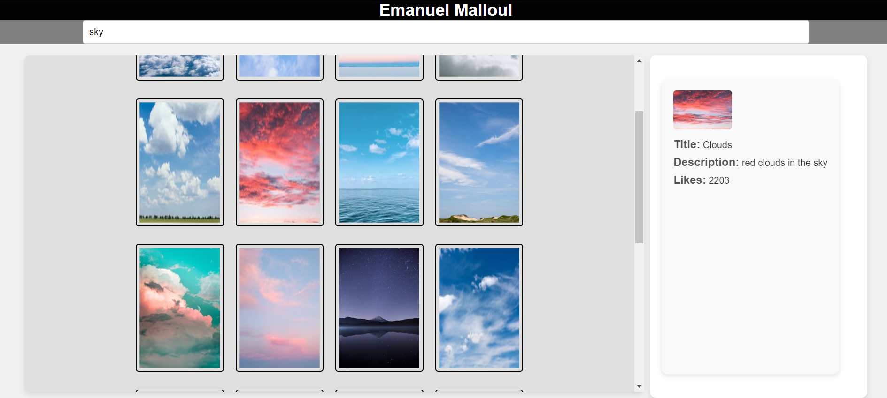
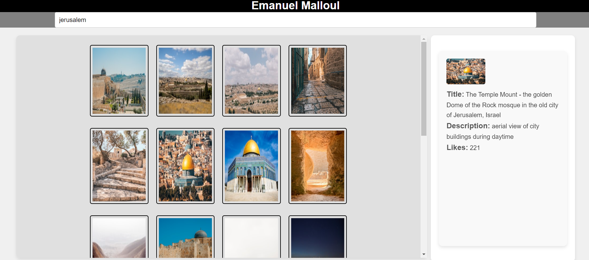

# Dynamic Image Search Web App

A web application for searching and displaying images dynamically using the Unsplash API.

---

**Description:**

This project is a web application that allows users to search for images using keywords and displays the results dynamically. It utilizes JavaScript to interact with the Unsplash API for fetching images based on user queries. The application features dynamic updates as the user types in the search input, showing relevant images instantly.

---

**Project Structure:**

1. **`index.html`:**
   - HTML file containing the structure of the web page.
   - Includes the search input, image display area, and information section.

2. **`styles.css`:**
   - CSS file defining the styles and layout of the web page.
   - Includes classes for styling the header, search input, images, buttons, and info area.

3. **`script.js`:**
   - JavaScript file handling API requests and dynamic updates.
   - Implements functions for searching images, displaying results, and updating image details.

---

**Dependencies:**
- Unsplash API
- JavaScript

---

**Usage:**

1. Open `index.html` in your web browser.
2. Enter keywords in the search input to search for images.
3. Images will dynamically appear as you type.
4. Click on an image to view details in the information section.

---

**Contributing:**

1. Fork the repository.
2. Create a new branch (`git checkout -b feature-branch`).
3. Make your changes and commit them (`git commit -am 'Add new feature'`).
4. Push to the branch (`git push origin feature-branch`).
5. Create a new Pull Request.

---

**Examples:**

    
    

---

